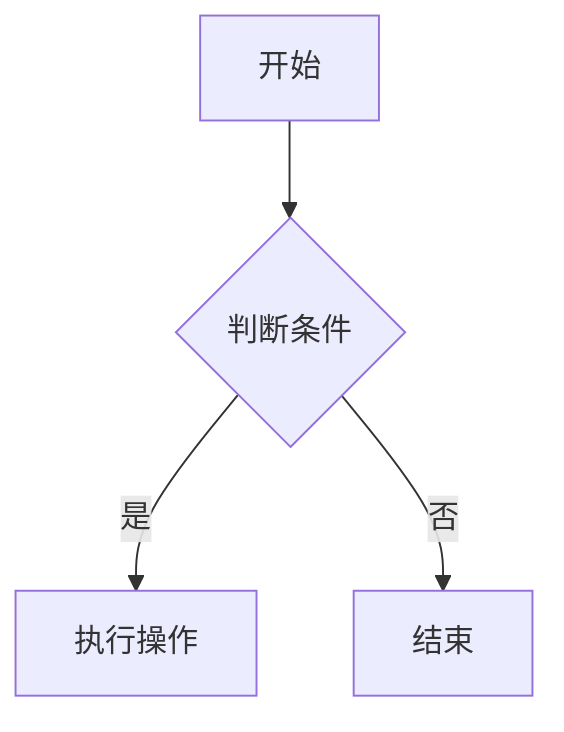

# Aurora Blog - 现代化个人博客系统

[](https://vuejs.org/)
[](https://vitejs.dev/)
[](https://element-plus.org/)
[](https://www.typescriptlang.org/)
[](https://tailwindcss.com/)

> 一个基于 Vue 3 + Vite 8 + Element Plus 的现代化个人博客系统，支持 Markdown 渲染、国际化、代码高亮、数学公式等丰富功能。

## ✨ 特性

- 🚀 **极速构建** - Vite 8.0.12 (Rolldown) 提供 60% 构建速度提升
- 📝 **Markdown 增强** - 支持 Mermaid 图表、KaTeX 数学公式、Emoji、脚注等
- 🎨 **现代化 UI** - Element Plus 组件库 + Tailwind CSS 样式
- 🌍 **国际化** - 内置 Vue I18n 多语言支持
- 💾 **状态持久化** - Pinia 状态管理 + 持久化插件
- 🖼️ **图片预览** - 支持图片懒加载和全屏预览
- 📱 **响应式设计** - 完美适配桌面端和移动端
- 🔍 **无限滚动** - 文章列表无限滚动加载
- 💬 **评论系统** - 完整的文章评论和回复功能
- 🏷️ **标签归档** - 文章分类、标签、归档功能

## 🚀 快速开始

### 前置条件

- **Node.js** >= 22.0.0（推荐 v24.15.0）
- **npm** >= 9.0.0
- **Git**
- **Aurora 后端服务**（需要 `aurora-go` 或 `aurora-springboot` 后端运行）

### 完整安装步骤

#### 1. 安装 Node.js（使用 nvm 管理版本 - 推荐）

```bash
# Windows 安装 nvm
# 下载并安装 nvm-windows: https://github.com/coreybutler/nvm-windows/releases

# 安装 Node.js v24.15.0
nvm install 24.15.0

# 切换到 v24.15.0
nvm use 24.15.0

# 验证版本
node -v  # v24.15.0
npm -v   # 对应版本
```

#### 2. 克隆项目

```bash
# 克隆主仓库
git clone https://github.com/nicenkg/aurora.git
cd aurora/aurora-vue/aurora-blog
```

#### 3. 安装依赖

```bash
# 使用 npm 安装
npm install

# 或使用 pnpm (推荐)
pnpm install
```

**⚠️ 注意事项：**

1. **Postinstall 脚本**: 项目包含 `patch-cytoscape.js` 脚本，会在 `npm install` 后自动运行，用于修复 Cytoscape.js 在 Vite 8 中的兼容性问题。

2. **可选依赖**: `@rolldown/binding-win32-x64-msvc` 是 Vite 8 (Rolldown) 的 native binding，Windows 系统会自动安装。

#### 4. 配置环境变量

创建 `.env.local` 文件（不要提交到 Git）：

```bash
# 复制示例文件（如果有的话）
cp .env.example .env.local

# 或手动创建 .env.local
```

**.env.local 配置示例：**

```ini
# API 基础路径（后端服务地址）
VITE_AURORA_PATH=http://localhost:8080

# 网站标题
VITE_SITE_TITLE=Aurora Blog

# 其他配置...
```

**环境变量说明：**

| 变量名 | 说明 | 默认值 |
|--------|------|--------|
| `VITE_AURORA_PATH` | 后端 API 地址 | `http://localhost:8080` |
| `VITE_SITE_TITLE` | 网站标题 | `Aurora Blog` |

#### 5. 启动后端服务

Aurora Blog 需要后端服务支持。你可以选择：

- **aurora-go** (推荐)：https://github.com/nicenkg/aurora-go
- **aurora-springboot**：https://github.com/nicenkg/aurora

按照后端项目的 README 启动服务。

**快速启动后端（以 aurora-go 为例）：**

```bash
# 克隆后端项目
git clone https://github.com/nicenkg/aurora-go.git
cd aurora-go

# 配置 config.yaml
# 启动服务
go run main.go
```

#### 6. 启动开发服务器

```bash
npm run dev
```

启动后访问: http://localhost:5173

## 📦 使用指南

### 基础命令

#### 开发模式

```bash
npm run dev
```

启动后访问: http://localhost:5173

#### 生产构建

```bash
npm run build
```

构建产物将输出到 `dist/` 目录。

#### 预览生产构建

```bash
npm run preview
```

#### 部署

```bash
npm run deploy
```

使用 `deploy.js` 脚本进行自动化部署（需要配置 `.env.local` 中的服务器信息）。

### 实际使用示例

#### 1. 配置博客信息

编辑 `src/config/` 目录下的配置文件：

```typescript
// src/config/site.ts
export const siteConfig = {
  title: '我的博客',
  description: '基于 Aurora 的个人博客',
  author: 'Your Name',
  logo: '/logo.png',
  // ... 更多配置
}
```

#### 2. 写文章（Markdown 示例）

在后端管理面板中创建文章，Markdown 内容支持以下扩展：

````markdown
# 文章标题

## Mermaid 图表



## 数学公式

行内公式：$E = mc^2$

块级公式：
$$
\frac{d}{dx}\left( \int_{a}^{x} f(t) dt \right) = f(x)
$$

## Emoji

:smile: :heart: :thumbsup:

## 自定义容器

::: info
这是一个信息提示
:::

::: warning
这是一个警告
:::

::: danger
这是一个危险提示
:::

## 代码高亮

```javascript
const greeting = 'Hello, World!';
console.log(greeting);
```

## 脚注

这是一个脚注示例[^1]。

[^1]: 这是脚注的内容。
````

#### 3. 自定义主题

编辑 `src/styles/` 目录下的样式文件，或修改 `tailwind.config.cjs` 自定义主题色：

```javascript
// tailwind.config.cjs
module.exports = {
  theme: {
    extend: {
      colors: {
        // 自定义颜色
        primary: '#your-color',
        secondary: '#your-secondary-color',
      },
      fontFamily: {
        sans: ['Inter', 'sans-serif'],
      }
    }
  }
}
```

#### 4. 配置国际化

编辑 `src/locales/` 目录下的语言文件：

```json
// src/locales/zh-CN.json
{
  "home": "首页",
  "articles": "文章",
  "archives": "归档",
  "tags": "标签",
  "about": "关于"
}
```

```json
// src/locales/en.json
{
  "home": "Home",
  "articles": "Articles",
  "archives": "Archives",
  "tags": "Tags",
  "about": "About"
}
```

#### 5. 添加自定义页面

1. 在 `src/views/` 创建 Vue 组件：

```vue
<!-- src/views/CustomPage.vue -->
<template>
  <div class="custom-page">
    <h1>自定义页面</h1>
    <p>这是一个自定义页面</p>
  </div>
</template>

<script setup>
// 页面逻辑
</script>

<style scoped>
.custom-page {
  padding: 2rem;
}
</style>
```

2. 在 `src/router/index.ts` 添加路由：

```typescript
// src/router/index.ts
const routes = [
  // ... 其他路由
  {
    path: '/custom',
    name: 'CustomPage',
    component: () => import('@/views/CustomPage.vue')
  }
]
```

#### 6. 使用 API 接口

在 `src/api/` 创建 API 文件：

```typescript
// src/api/custom.ts
import request from '@/utils/request'

export const customAPI = {
  // 获取自定义数据
  getCustomData: () => request.get('/api/custom'),
  
  // 创建自定义数据
  createCustomData: (data: any) => request.post('/api/custom', data)
}
```

在组件中使用：

```vue
<script setup>
import { customAPI } from '@/api/custom'

const fetchData = async () => {
  const { data } = await customAPI.getCustomData()
  console.log(data)
}
</script>
```

## 📁 项目结构

```
aurora-blog/
├── public/                      # 静态资源
│   ├── favicon.ico            # 网站图标
│   ├── aurora-logo.html      # Logo 页面
│   └── http-client.env.json  # HTTP 客户端环境配置
├── src/                       # 源代码
│   ├── api/                  # API 接口
│   ├── assets/              # 项目资源文件
│   ├── components/          # 通用组件
│   │   ├── ArticleCard/    # 文章卡片组件
│   │   ├── Comment/        # 评论组件
│   │   ├── Feature/        # 功能特性组件
│   │   └── ...            # 其他组件
│   ├── config/             # 配置文件
│   ├── icons/              # SVG 图标
│   ├── locales/            # 国际化文件
│   ├── plugins/            # 插件配置
│   ├── router/             # 路由配置
│   │   ├── guard/         # 路由守卫
│   │   └── index.ts       # 路由定义
│   ├── stores/             # Pinia 状态管理
│   ├── styles/             # 全局样式
│   ├── utils/              # 工具函数
│   ├── views/              # 页面视图
│   │   ├── Home.vue       # 首页
│   │   ├── Article.vue    # 文章详情
│   │   ├── ArticleList.vue # 文章列表
│   │   ├── Archives.vue   # 归档页面
│   │   ├── Tags.vue       # 标签页面
│   │   ├── About.vue      # 关于页面
│   │   ├── FriendLink.vue # 友链页面
│   │   ├── Photos.vue     # 相册页面
│   │   ├── Talk.vue       # 说说页面
│   │   ├── TalkList.vue   # 说说列表
│   │   ├── Message.vue    # 留言板
│   │   └── 404.vue       # 404 页面
│   ├── App.vue             # 根组件
│   ├── main.ts             # 入口文件
│   ├── auto-imports.d.ts  # 自动导入类型声明
│   ├── components.d.ts     # 组件类型声明
│   ├── env.d.ts           # 环境类型声明
│   └── shims-vue.d.ts    # Vue 类型声明
├── index.html               # HTML 模板
├── package.json             # 项目配置
├── vite.config.ts          # Vite 配置
├── tsconfig.json           # TypeScript 配置
├── tailwind.config.cjs     # Tailwind CSS 配置
├── postcss.config.cjs      # PostCSS 配置
├── patch-cytoscape.js      # Cytoscape 补丁脚本
├── deploy.js               # 部署脚本
└── .workbuddy/            # WorkBuddy 工作区
```

## ⚙️ 配置

### Vite 配置

项目使用 Vite 8.0.12，配置文件位于 `vite.config.ts`，主要配置包括：

- **@vitejs/plugin-vue** - Vue 3 支持
- **vite-plugin-prismjs** - Prism.js 代码高亮
- **vite-plugin-svg-icons** - SVG 图标集成
- **unplugin-auto-import** - API 自动导入
- **unplugin-vue-components** - 组件自动导入

### TypeScript 配置

TypeScript 6.0.3 配置位于 `tsconfig.json`，支持：

- Vue 3 类型检查
- 严格模式
- 路径别名配置（`@/` 映射到 `src/`）

### Tailwind CSS 配置

Tailwind CSS 3.4.19 配置位于 `tailwind.config.cjs`，可自定义主题、颜色和字体。

### 国际化配置

国际化文件位于 `src/locales/`，支持多语言切换。

## 🎯 主要功能

### 1. 首页

展示博客统计信息、文章列表、网站配置等。

### 2. 文章系统

- 文章列表（支持分页和无限滚动）
- 文章详情（Markdown 渲染、代码高亮、目录导航）
- 文章归档（按日期分类）
- 标签系统

### 3. Markdown 支持

- **Mermaid 图表** - 流程图、时序图、类图等
- **KaTeX 数学公式** - 行内和块级公式
- **Emoji 表情** - 丰富的 Emoji 支持
- **代码高亮** - Prism.js 语法高亮
- **自定义容器** - Info、Warning、Danger 等
- **脚注** - 文章脚注支持

### 4. 评论系统

- 评论列表
- 回复功能
- 评论点赞

### 5. 相册系统

- 相册列表
- 照片预览

### 6. 说说系统

- 说说列表
- 说说详情

### 7. 其他功能

- 友链页面
- 关于页面
- 留言板
- 搜索功能

## 🔧 开发指南

### 添加新页面

1. 在 `src/views/` 创建 Vue 组件
2. 在 `src/router/index.ts` 添加路由
3. 如需保护路由，在 `src/router/guard/` 配置路由守卫

### 添加新组件

1. 在 `src/components/` 创建组件
2. 组件会自动导入（unplugin-vue-components）
3. 如需在多个页面使用，确保组件名称唯一

### 添加 API 接口

1. 在 `src/api/` 创建 API 文件
2. 使用 Axios 封装的请求函数
3. API 会自动导入（unplugin-auto-import）

### 状态管理

1. 在 `src/stores/` 创建 Pinia store
2. 使用 `pinia-plugin-persistedstate` 实现状态持久化
3. Store 会自动导入

## 🤝 贡献指南

我们欢迎任何形式的贡献！

### 贡献流程

1. **Fork 项目**

   ```bash
   # 点击 GitHub 右上角的 Fork 按钮
   ```

2. **创建特性分支**

   ```bash
   git checkout -b feature/amazing-feature
   ```

3. **提交更改**

   ```bash
   git commit -m 'Add some AmazingFeature'
   ```

4. **推送到分支**

   ```bash
   git push origin feature/amazing-feature
   ```

5. **打开 Pull Request**

   访问 GitHub 项目页面，点击 "New Pull Request"

### 代码规范

- 使用 TypeScript 编写代码
- 遵循 Vue 3 风格指南
- 使用 Prettier 格式化代码（配置文件：`.prettierrc`）
- 组件名称使用 PascalCase
- 变量和函数使用 camelCase
- 常量使用 UPPER_SNAKE_CASE

### 提交规范

遵循 [Conventional Commits](https://www.conventionalcommits.org/) 规范：

```
<type>(<scope>): <subject>

<body>

<footer>
```

**Type 类型：**

- `feat`: 新功能
- `fix`: 修复 Bug
- `docs`: 文档更新
- `style`: 代码格式（不影响代码运行的变动）
- `refactor`: 重构（既不是新功能也不是修复 Bug）
- `perf`: 性能优化
- `test`: 测试相关
- `chore`: 构建过程或辅助工具的变动
- `ci`: CI 配置文件和脚本的变动

**示例：**

```bash
feat(article): 添加文章目录功能

- 集成 tocbot 生成文章目录
- 添加目录样式
- 优化移动端目录显示

Closes #123
```

### Issue 报告

发现 Bug 或有新功能建议？请创建 Issue：

1. 访问 GitHub 项目页面
2. 点击 "Issues" 标签
3. 点击 "New Issue"
4. 选择合适的模板（Bug report / Feature request）
5. 填写详细信息

**Bug 报告应包括：**

- 问题描述
- 复现步骤
- 预期行为
- 实际行为
- 截图（如果有）
- 环境信息（浏览器、操作系统、Node.js 版本等）

### 开发环境设置

1. **安装依赖**

   ```bash
   npm install
   ```

2. **启动开发服务器**

   ```bash
   npm run dev
   ```

3. **运行类型检查**

   ```bash
   vue-tsc --noEmit
   ```

4. **构建生产版本**

   ```bash
   npm run build
   ```

### 测试指南

目前项目尚未集成自动化测试，计划中的测试框架：

- **Vitest** - 单元测试
- **@vue/test-utils** - 组件测试
- **Playwright** - E2E 测试

### 文档贡献

文档是项目的重要组成部分！

- 修复文档错误
- 添加使用示例
- 翻译文档
- 添加 API 文档

### 社区行为准则

请阅读并遵守我们的 [行为准则](CODE_OF_CONDUCT.md)（如果有的话）。

## 📝 更新日志

查看 [升级评估报告.md](./升级评估报告.md) 了解详细的版本升级记录。

### 最新版本

- **Vite 8.0.12** - 升级到 Vite 8 (Rolldown)，构建速度提升 60%
- **Vue 3.5.34** - 最新稳定版 Vue 3
- **Element Plus 2.14.0** - 最新 UI 组件库
- **TypeScript 6.0.3** - 最新 TypeScript 版本
- **依赖全面升级** - 所有依赖升级到最新版本

## 🔧 故障排查

### Node.js 版本问题

**问题**: `npm install` 或 `npm run dev` 失败，报错版本不兼容。

**解决方案**:
```bash
# 检查 Node.js 版本
node -v

# 如果版本低于 22.0.0，使用 nvm 安装推荐版本
nvm install 24.15.0
nvm use 24.15.0
```

### 依赖安装失败

**问题**: `npm install` 报错 `ETIMEDOUT` 或 `ENETUNREACH`。

**解决方案**:
```bash
# 使用国内镜像
npm install --registry=https://registry.npmmirror.com

# 或使用 pnpm
pnpm install
```

### 后端 API 连接失败

**问题**: 前端启动后，API 请求失败，控制台报错 `ECONNREFUSED` 或 `404`。

**解决方案**:
1. 确认后端服务已启动（aurora-go 或 aurora-springboot）
2. 检查 `.env.local` 中的 `VITE_AURORA_PATH` 是否正确
3. 检查 Vite 开发服务器代理配置（`vite.config.ts` 中的 `server.proxy`）

```bash
# 测试后端 API 是否可访问
curl http://localhost:8080/api/articles/topAndFeatured
```

### TypeScript 类型错误

**问题**: 运行 `npm run build` 时 TypeScript 类型检查失败。

**解决方案**:
```bash
# 查看具体错误
npx vue-tsc --noEmit

# 临时跳过类型检查（不推荐）
# 修改 vite.config.ts，设置 ignoreBuildErrors: true
```

### 图片预览不工作

**问题**: 文章中的图片无法点击预览。

**原因**: 图片点击事件监听器未正确绑定。

**解决方案**: 检查 `Article.vue` 中的 `addImageClickListeners()` 函数是否正确执行。

### 国际化不工作

**问题**: 切换语言后，页面文字没有更新。

**解决方案**:
1. 检查 `src/locales/` 目录下是否有对应的语言文件
2. 检查 `vue-i18n` 配置是否正确
3. 确保组件中使用 `$t()` 或 `t()` 函数

```vue
<script setup>
import { useI18n } from 'vue-i18n'

const { t } = useI18n()
console.log(t('home'))  // 调试输出
</script>
```

### 构建产物过大

**问题**: `npm run build` 后 `dist/` 目录体积过大。

**解决方案**:
1. 检查 `vite.config.ts` 中的 `build.rollupOptions.output.manualChunks` 配置
2. 使用 `vite-plugin-compression` 开启 Gzip 压缩
3. 检查是否有未使用的依赖被打包

```bash
# 分析打包体积
npm install -D rollup-plugin-visualizer
# 然后在 vite.config.ts 中配置 visualizer 插件
```

---

## 💡 常见问题 (FAQ)

### Q: 如何自定义主题颜色？

**A**: 编辑 `tailwind.config.cjs`，在 `theme.extend.colors` 中添加自定义颜色：

```javascript
// tailwind.config.cjs
module.exports = {
  theme: {
    extend: {
      colors: {
        primary: '#your-color',
        secondary: '#your-secondary-color',
      }
    }
  }
}
```

### Q: 如何添加新的页面？

**A**: 3 步完成：

1. 在 `src/views/` 创建 Vue 组件
2. 在 `src/router/index.ts` 添加路由
3. 如果需要，在后端添加对应的 API 接口

### Q: 如何修改网站标题和 Logo？

**A**: 编辑 `src/config/site.ts`（或类似配置文件），修改 `title`、`logo` 等字段。

### Q: 如何部署到生产环境？

**A**: 参考 [使用指南 - 部署](#部署) 部分，或使用 `deploy.js` 脚本：

```bash
# 配置 .env.local 中的服务器信息
npm run deploy
```

### Q: 为什么我的 Markdown 公式不渲染？

**A**: 确保：
1. 后端返回的文章内容包含正确的 KaTeX 语法（`$inline$` 或 `$$block$$`）
2. 前端已安装并配置 `markdown-it-katex` 插件
3. 已引入 KaTeX CSS 样式

### Q: 如何优化网站性能？

**A**: 参考以下建议：
1. 开启图片懒加载（已内置）
2. 使用路由懒加载（`() => import('@/views/...')`）
3. 开启 Gzip 压缩（`vite-plugin-compression`）
4. 使用 CDN 加速静态资源
5. 优化图片大小（使用 `image-conversion` 压缩）

### Q: 如何贡献代码？

**A**: 参考 [贡献指南](#-贡献指南) 部分，遵循 Conventional Commits 规范提交 PR。

---

## 📄 开源协议

本项目采用 MIT 协议开源 - 查看 [LICENSE](LICENSE) 文件了解详情。

## 🙏 致谢

- [Vue.js](https://vuejs.org/) - 渐进式 JavaScript 框架
- [Vite](https://vitejs.dev/) - 下一代前端构建工具
- [Element Plus](https://element-plus.org/) - Vue 3 UI 组件库
- [Pinia](https://pinia.vuejs.org/) - Vue 3 状态管理
- [markdown-it](https://github.com/markdown-it/markdown-it) - Markdown 解析器
- [Prism.js](https://prismjs.com/) - 代码高亮库

## 📧 联系方式

- **作者**: 七七
- **QQ**: 2316364297
- **网站**: https://www.aqi125.cn
- **GitHub**: [aqi-qihuan/aurora: 基于SpringBoot4.1.X+Vue3开发的个人博客系统](https://github.com/aqi-qihuan/aurora)

---

⭐ 如果这个项目对你有帮助，请给它一个 Star！
